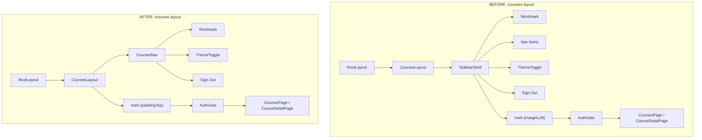

# Architecture Report: Courses/Lectures Route Layout Refactor

> **Refactor complete.** SidebarShell has been replaced by the shared SiteNav component.
> See `docs/architecture/SITENAV_ROUTE_AUDIT.md` for the current architecture.
> The sections below are preserved as a historical record of the analysis that led to the refactor.

## Status: Complete (2026-02-07)

---

## 1. Current Architecture

### 1.1 Layout Nesting (Courses Routes)

```
RootLayout (src/app/layout.tsx)
  -> ClerkProvider + Providers (Convex)
    -> CoursesLayout (src/app/courses/layout.tsx)  [use client]
      -> SidebarShell (src/ui/shell/SidebarShell.tsx)
        -> /courses -> AuthGate -> CoursesPage
        -> /courses/[courseId] -> AuthGate -> CourseDetailPage
```

The **CoursesLayout** (`src/app/courses/layout.tsx`) is 15 lines. Its sole responsibility is wrapping `children` in `<SidebarShell>`. It is a client component (`"use client"`).

### 1.2 SidebarShell Component

**File:** `src/ui/shell/SidebarShell.tsx` (349 lines)

**What it provides:**

- Fixed left sidebar (`position: fixed`) with animated width (56px collapsed / 240px expanded)
- Wordmark link to `/` (full text or single "n" when collapsed)
- Nav items: "Courses" (links to `/courses`), "Settings" (disabled)
- Active route highlighting via `usePathname()` match
- Theme toggle (`ThemeToggle` from `@/ui/shared/ThemeToggle`)
- Sign out button via `useClerk().signOut()`
- Sidebar collapse/expand toggle persisted to `localStorage("niotebook.sidebar")`
- Auto-collapse on mobile (`max-width: 768px`)
- Main content area with `marginLeft` matching sidebar width

**Dependencies:**

- `@clerk/nextjs` (useClerk for signOut)
- `next/navigation` (usePathname for active state)
- `next/link` (nav items)
- `@/infra/storageAdapter` (localStorage)
- `@/ui/shared/ThemeToggle`

### 1.3 LandingNav Component

**File:** `src/ui/landing/LandingNav.tsx` (32 lines)

**What it provides:**

- Fixed top navbar (`position: fixed, top: 0, z-50`)
- Wordmark via `Wordmark` component (links to `/`)
- Theme toggle (imports from local `./ThemeToggle`, which re-exports `@/ui/shared/ThemeToggle`)
- "Sign in" link to `/sign-in`
- Backdrop blur + semi-transparent background + border-bottom

**What it does NOT provide:**

- No auth awareness (no Clerk hooks, no signed-in/signed-out branching)
- No sign out button
- No active route highlighting
- No user account/profile link

**Currently used by:** Only `src/app/page.tsx` (landing page)

### 1.4 AuthShell Nav Bar Pattern

**File:** `src/ui/auth/AuthShell.tsx` (lines 39-61)

The AuthShell has an inline nav bar that closely mirrors LandingNav but with a "Home" link instead of "Sign in". This is the pattern used by sign-in, sign-up, and AuthGate loading/redirect states.

Both AuthShell's nav and LandingNav share:

- Same positioning: `fixed top-0 left-0 right-0 z-50`
- Same backdrop blur + `color-mix(in srgb, var(--background) 80%, transparent)`
- Same `border-bottom: 1px solid var(--border)`
- Same `px-4 sm:px-6 py-4`
- Same ThemeToggle + action button layout

### 1.5 Page Components

**CoursesPage** (`src/ui/courses/CoursesPage.tsx`):

- Wraps content in `NotebookFrame compact` on `sm+`, plain on mobile
- Container: `mx-auto w-full max-w-[1100px] px-6 py-12`
- No header/nav of its own -- relies on SidebarShell for navigation

**CourseDetailPage** (`src/ui/courses/CourseDetailPage.tsx`):

- Same NotebookFrame pattern (`compact`, hidden on mobile)
- Container: `mx-auto w-full max-w-[900px] px-6 py-10`
- Has a "Back to courses" link
- No header/nav of its own -- relies on SidebarShell for navigation

---

## 2. The Problem

The courses routes currently use SidebarShell, but the desired UX is to revert to the landing page's top navbar pattern (LandingNav). The core issue is that LandingNav is designed for unauthenticated visitors, while courses routes require authentication. Swapping SidebarShell for LandingNav creates a gap: the signed-in user loses their sign out button, any user-facing controls, and route context.

### 2.1 Forces at Play

| Force              | Description                                                                                                                                                                   |
| ------------------ | ----------------------------------------------------------------------------------------------------------------------------------------------------------------------------- |
| **Simplicity**     | SidebarShell is 349 lines of layout logic for a feature (Settings nav) that does not yet exist. A top nav is simpler for a catalogue page.                                    |
| **Consistency**    | The landing page, auth pages, and courses should share a visual language. Currently, crossing from `/` to `/courses` changes the entire layout paradigm (top nav to sidebar). |
| **Auth awareness** | The current LandingNav shows "Sign in" to everyone. Courses routes need "Sign out" (or a user menu) for authenticated users.                                                  |
| **Feature loss**   | SidebarShell provides: sign out, active route indicator, sidebar persistence. These must be preserved or replaced.                                                            |
| **Content width**  | SidebarShell eats 56-240px of horizontal space. Removing it gives the full viewport to course content.                                                                        |
| **Mobile parity**  | SidebarShell auto-collapses to 56px on mobile, still consuming space. A top nav is more natural on mobile.                                                                    |

---

## 3. Options Considered

### Option A: Create a CoursesNav Variant of LandingNav

**Description:** Create a new `CoursesNav` component (or make LandingNav accept props) that renders the same top-bar design but with auth-aware right-side actions: ThemeToggle + sign out button (or user dropdown) instead of "Sign in" link. Replace SidebarShell in `src/app/courses/layout.tsx` with this new nav.

**Component structure:**

```
CoursesNav (new, ~60 lines)
  -> Wordmark
  -> ThemeToggle
  -> Sign Out button (useClerk().signOut)
```

**File changes:**

1. **New file:** `src/ui/shell/CoursesNav.tsx` -- top navbar with auth controls
2. **Edit:** `src/app/courses/layout.tsx` -- replace SidebarShell import with CoursesNav, add a `<main>` wrapper with `pt-[64px]` to offset fixed nav
3. **No changes** to CoursesPage, CourseDetailPage, or AuthGate

**Pros:**

- Clean separation: landing nav (unauthenticated) vs courses nav (authenticated)
- Minimal impact on existing components
- CoursesPage and CourseDetailPage need zero changes
- Can add user profile / dropdown later without touching other routes

**Cons:**

- Two similar-but-different nav components (LandingNav and CoursesNav)
- Slight duplication of the nav bar chrome (backdrop blur, border, positioning)

**Effort:** Low
**Risk:** Low

---

### Option B: Make LandingNav Auth-Aware (Single Component)

**Description:** Modify LandingNav to accept auth state (or read it from Clerk) and render different right-side content: "Sign in" for unauthenticated, "Sign out" for authenticated. Use this single component on both landing and courses routes.

**File changes:**

1. **Edit:** `src/ui/landing/LandingNav.tsx` -- add Clerk hooks or accept props for auth state, render conditionally
2. **Edit:** `src/app/courses/layout.tsx` -- replace SidebarShell with LandingNav + `<main>` with padding-top
3. **No changes** to CoursesPage, CourseDetailPage

**Pros:**

- Single nav component for the entire public/courses surface
- DRY -- no duplication of nav chrome
- Consistent visual language guaranteed by construction

**Cons:**

- Makes LandingNav a client component (`"use client"`) because Clerk hooks require it. Currently LandingNav is a server component (no `"use client"` directive).
- Mixing authenticated and unauthenticated concerns in one component increases coupling
- If landing page nav evolves differently from courses nav (e.g., marketing CTAs, feature announcements), the component accumulates conditional branches
- Importing `@clerk/nextjs` on the landing page adds to the bundle even for unauthenticated visitors

**Effort:** Low
**Risk:** Medium (server-to-client component conversion, bundle impact on landing)

---

### Option C: Extract Shared NavBar Chrome, Compose Two Variants

**Description:** Extract the shared nav bar shell (the fixed top bar with backdrop blur, border, and positioning) into a `NavBarShell` component. Then compose two variants:

- `LandingNav` = `NavBarShell` + Wordmark + ThemeToggle + "Sign in" link
- `CoursesNav` = `NavBarShell` + Wordmark + ThemeToggle + "Sign out" button

**File changes:**

1. **New file:** `src/ui/shared/NavBarShell.tsx` (~20 lines) -- the shared chrome
2. **Edit:** `src/ui/landing/LandingNav.tsx` -- use NavBarShell
3. **New file:** `src/ui/shell/CoursesNav.tsx` (~40 lines) -- use NavBarShell + Clerk signOut
4. **Edit:** `src/app/courses/layout.tsx` -- replace SidebarShell with CoursesNav

**Pros:**

- Zero duplication of the nav chrome (backdrop blur, border, positioning)
- LandingNav stays a server component
- Clear boundary: NavBarShell owns chrome, variants own content
- Future-proof: easy to add more nav variants (admin nav, etc.)
- AuthShell could also adopt NavBarShell, unifying all three nav instances

**Cons:**

- One more abstraction layer (three files instead of two)
- Over-engineering for what is currently a 10-line shared pattern

**Effort:** Low-Medium
**Risk:** Low

---

## 4. Recommendation

**Option A: Create a CoursesNav variant** is the recommended approach.

**Rationale:**

The shared chrome between LandingNav and CoursesNav is minimal (5 CSS properties on a `<nav>` element). Extracting it into NavBarShell (Option C) adds a layer of indirection for negligible DRY gain. Meanwhile, making LandingNav auth-aware (Option B) forces a server-to-client component conversion with real bundle consequences for the landing page.

Option A keeps things simple: one new file, one edited file, zero changes to page components. The duplication is limited to a single `<nav>` element with shared Tailwind classes, which is acceptable.

**If the project later needs a third nav variant (e.g., admin)**, then revisiting Option C (NavBarShell extraction) makes sense. But for two variants, the indirection is not worth it.

---

## 5. Concrete File Change Plan (Option A)

### 5.1 New File: `src/ui/shell/CoursesNav.tsx`

**Purpose:** Authenticated top navigation bar for courses routes.

**Must include:**

- `"use client"` (needs Clerk hooks)
- Fixed top-bar with same visual treatment as LandingNav:
  - `fixed top-0 left-0 right-0 z-50`
  - `backdrop-blur-md`
  - `background: color-mix(in srgb, var(--background) 80%, transparent)`
  - `border-bottom: 1px solid var(--border)`
  - `px-4 sm:px-6 py-4`
- Left: `<Wordmark height={40} />`
- Right: `<ThemeToggle />` + Sign out button
- Sign out via `useClerk().signOut()`
- Estimated size: ~50-60 lines

**Imports:**

```
import Link from "next/link";
import { useClerk } from "@clerk/nextjs";
import { Wordmark } from "@/ui/brand/Wordmark";
import { ThemeToggle } from "@/ui/shared/ThemeToggle";
```

### 5.2 Edit: `src/app/courses/layout.tsx`

**Current (15 lines):**

```tsx
"use client";
import { SidebarShell } from "@/ui/shell/SidebarShell";

export default function CoursesLayout({ children }) {
  return <SidebarShell>{children}</SidebarShell>;
}
```

**After (~20 lines):**

```tsx
import { CoursesNav } from "@/ui/shell/CoursesNav";

export default function CoursesLayout({ children }) {
  return (
    <>
      <CoursesNav />
      <main className="pt-[64px]">{children}</main>
    </>
  );
}
```

**Key change:** The `"use client"` directive can be removed from the layout if CoursesNav handles its own client boundary (it will, since it uses Clerk hooks). The layout itself becomes a server component. However, since CoursesNav is a client component imported into a server layout, Next.js handles this automatically -- the layout remains a server component.

**Padding note:** LandingNav has `py-4` = 16px top + 16px bottom = 32px, plus content height. The Wordmark at `height={40}` makes the nav approximately 40 + 32 = 72px. Round up for border: `pt-20` (80px) is safe. Or use `pt-[72px]` for precision. Measure and adjust.

### 5.3 No Changes Required

These files need **zero** modifications:

- `src/ui/courses/CoursesPage.tsx` -- its container (`mx-auto max-w-[1100px] px-6 py-12`) works the same with or without sidebar
- `src/ui/courses/CourseDetailPage.tsx` -- same reasoning
- `src/ui/shared/NotebookFrame.tsx` -- purely a content wrapper, layout-agnostic
- `src/ui/shared/ThemeToggle.tsx` -- no change
- `src/ui/auth/AuthGate.tsx` -- still used by route pages, unaffected by layout change
- `src/app/courses/page.tsx` -- just renders `<AuthGate><CoursesPage /></AuthGate>`
- `src/app/courses/[courseId]/page.tsx` -- just renders `<AuthGate><CourseDetailPage /></AuthGate>`

### 5.4 Post-Refactor: SidebarShell Status

After this refactor, `SidebarShell` will have **zero imports** across the codebase (currently only imported by `src/app/courses/layout.tsx`). It becomes dead code.

**Recommended action:** Delete `src/ui/shell/SidebarShell.tsx` in the same PR, or flag it for removal. The `niotebook.sidebar` localStorage key also becomes orphaned and can be cleaned up.

---

## 6. Impact Assessment

### What Changes

| Item                            | Impact                                                |
| ------------------------------- | ----------------------------------------------------- |
| `src/app/courses/layout.tsx`    | Rewritten (SidebarShell -> CoursesNav + main wrapper) |
| `src/ui/shell/CoursesNav.tsx`   | New file (~50 lines)                                  |
| `src/ui/shell/SidebarShell.tsx` | Becomes dead code (delete candidate)                  |

### What Breaks (Nothing, if Done Correctly)

- **Layout shift:** The `<main>` content shifts from `marginLeft: 56-240px` to `paddingTop: ~72px`. This is the intended visual change, not a bug.
- **Sign out:** Preserved in CoursesNav.
- **Theme toggle:** Preserved in CoursesNav.
- **Active route indicator:** Lost. SidebarShell highlights the active nav item. The new top nav does not have nav items (just Wordmark + controls). This is acceptable because courses routes only have one destination (`/courses`); there is no multi-route nav to indicate.
- **Sidebar collapse state:** `localStorage("niotebook.sidebar")` becomes unused. No functional impact.

### What Gets Better

- ~290 fewer lines of layout code in the render tree for courses routes
- Full viewport width available for course content (no 56-240px sidebar)
- Consistent top-nav pattern across landing, auth, and courses pages
- Mobile layout no longer has a fixed 56px sidebar eating horizontal space

### What Gets Slightly Worse

- Two nav components exist (LandingNav and CoursesNav) with similar chrome -- minor duplication

---

## 7. AuthGate + CoursesNav Interaction

One subtle point: `AuthGate` renders `AuthShell` during loading/redirect states, which has its own inline nav bar. So during the loading state, the user sees **AuthShell's nav** (with "Home" link). Once authenticated, they see **CoursesNav** (with "Sign out"). This is the same behavior as today (AuthGate loading shows AuthShell, then SidebarShell appears).

The visual transition from AuthShell-nav to CoursesNav will be smoother than today's AuthShell-nav to SidebarShell, because both are now top navbars with the same backdrop-blur chrome.

---

## 8. Diagram: Before and After



---

## 9. Open Questions for the User/Lead

1. **Should CoursesNav show the user's name/avatar?** Currently SidebarShell does not show user info, just a sign-out button. Should CoursesNav add a user avatar (via Clerk's `useUser()`) or keep it minimal (just sign-out)?

2. **Should the "Courses" link appear in CoursesNav?** SidebarShell had a "Courses" nav item that was always active on these routes. A top nav could include a "Courses" text link, but since we are already on courses routes, it may be redundant. The Wordmark links to `/` which is the landing page.

3. **Should the landing page LandingNav show "Courses" for authenticated users?** Today, a signed-in user visiting `/` sees "Sign in" in the LandingNav even though they are already signed in. This is a separate issue but related to the nav story.

4. **Delete SidebarShell immediately or keep it?** If there are plans to reuse the sidebar pattern for workspace or settings in the future, it might be worth keeping. If not, deleting reduces maintenance burden.

---

## 10. Resolution (2026-02-07)

The refactor was implemented on the `refactor/courses-navbar-layout` branch. The final approach evolved beyond Option A into a **shared SiteNav component** (Option C-inspired) that all three public-facing navbars now consume.

### What Was Built

| Component             | File                                   | Purpose                                                                             |
| --------------------- | -------------------------------------- | ----------------------------------------------------------------------------------- |
| **SiteNav**           | `src/ui/shared/SiteNav.tsx`            | Shared fixed top nav bar (backdrop-blur chrome, Wordmark left, children slot right) |
| **CoursesNavActions** | `src/ui/courses/CoursesNavActions.tsx` | Right-side actions for courses routes (ThemeToggle + Sign out)                      |

### What Was Deleted

| File                                | Reason                                                                |
| ----------------------------------- | --------------------------------------------------------------------- |
| `src/ui/shell/SidebarShell.tsx`     | Replaced by SiteNav — zero imports remaining                          |
| `src/ui/courses/CourseCarousel.tsx` | Dead code — was never imported                                        |
| `src/ui/landing/ThemeToggle.tsx`    | Re-export shim removed (canonical: `src/ui/shared/ThemeToggle.tsx`)   |
| `src/ui/landing/NotebookFrame.tsx`  | Re-export shim removed (canonical: `src/ui/shared/NotebookFrame.tsx`) |

### Orphaned State

- `localStorage("niotebook.sidebar")` — No longer read or written by any source code. Persists in users' browsers until cleared naturally.

### Current Courses Layout

```tsx
// src/app/courses/layout.tsx (~21 lines)
import { SiteNav } from "@/ui/shared/SiteNav";
import { CoursesNavActions } from "@/ui/courses/CoursesNavActions";

export default function CoursesLayout({ children }) {
  return (
    <>
      <SiteNav wordmarkHref="/courses">
        <CoursesNavActions />
      </SiteNav>
      <main className="pt-[72px]">{children}</main>
    </>
  );
}
```

### SiteNav Consumers (3 routes)

| Route                  | Consumer      | Children                                   |
| ---------------------- | ------------- | ------------------------------------------ |
| `/` (landing)          | LandingNav    | ThemeToggle + auth link                    |
| `/sign-in`, `/sign-up` | AuthShell     | ThemeToggle + "Home" link                  |
| `/courses/*`           | CoursesLayout | CoursesNavActions (ThemeToggle + Sign out) |

### Architecture Reference

See `docs/architecture/SITENAV_ROUTE_AUDIT.md` for the full route audit, SiteNav API review, and file boundary plan.
