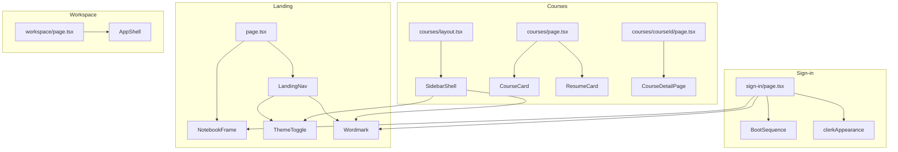
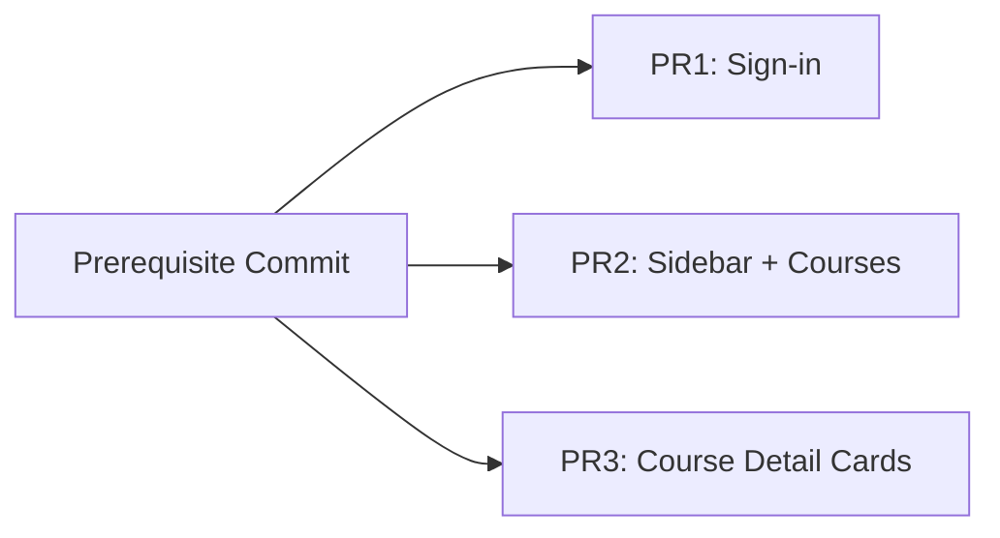

# Phase 8 — Route Redesign: Technical Architecture

> **Status:** Proposed
> **Author:** Architect Agent
> **Date:** 2026-02-06
> **Branch:** `redesign-v2` (base for all PRs)
> **Scope:** Sign-in, Courses, Course Detail pages + new sidebar shell

---

## Table of Contents

1. [Sidebar Shell Architecture](#1-sidebar-shell-architecture)
2. [Component Dependency Graph](#2-component-dependency-graph)
3. [NotebookFrame Adaptations](#3-notebookframe-adaptations)
4. [Theme Migration Plan](#4-theme-migration-plan)
5. [Clerk Appearance Update](#5-clerk-appearance-update)
6. [PR Structure](#6-pr-structure)
7. [Testing Impact](#7-testing-impact)
8. [Risk Areas](#8-risk-areas)

---

## 1. Sidebar Shell Architecture

### Problem

Currently, authenticated routes (`/courses`, `/courses/[courseId]`) use `CoursesLayout` (`src/app/courses/layout.tsx`), a minimal client-side layout with a top header bar containing the Wordmark and a sign-out button. The workspace uses `AppShell` (`src/ui/shell/AppShell.tsx`) with `TopNav` + `LayoutPresetProvider`. There is no shared navigation chrome between courses and workspace — they are completely independent shells.

The brief calls for a **collapsible rail sidebar** (icon rail ↔ expanded panel) shared by all authenticated routes except workspace (which keeps its own `AppShell`).

### Proposed Component: `SidebarShell`

**Location:** `src/ui/shell/SidebarShell.tsx` (new file)

**Subcomponents:**
- `SidebarRail` — The collapsed state: icon-only vertical rail, ~56px wide
- `SidebarExpanded` — The expanded state: ~240px panel with icon + label per item
- `SidebarShell` — The wrapper that composes rail/expanded + main content area

```
┌──────────────────────────────────────────────┐
│ SidebarShell                                 │
│ ┌────┬───────────────────────────────────────┐│
│ │Rail│  Main content area                    ││
│ │56px│  (children)                           ││
│ │    │                                       ││
│ │ 📚 │                                       ││
│ │ 🏠 │                                       ││
│ │ ⚙️ │                                       ││
│ │    │                                       ││
│ │    │                                       ││
│ │────│                                       ││
│ │ 🌙 │  ← ThemeToggle at bottom             ││
│ │ 🚪 │  ← Sign out at bottom                ││
│ └────┴───────────────────────────────────────┘│
└──────────────────────────────────────────────┘
```

### State Management

**Option A: localStorage + React state (Recommended)**
- `useState<boolean>` for `isExpanded`, initialized from `localStorage.getItem("niotebook.sidebar")`
- On toggle: update state + write to localStorage
- On mount: read localStorage, default to `true` (expanded) if not set
- Responsive: `useMediaQuery` or `useEffect` with `matchMedia("(max-width: 768px)")` — auto-collapse below `md`
- No Zustand store needed — sidebar state is UI-only and doesn't interact with domain logic

**Option B: Zustand store**
- Overkill for this use case. No other component needs to read sidebar state.
- Would add coupling to the store layer for a purely visual concern.

**Recommendation:** Option A. The ThemeToggle already uses this exact pattern (localStorage + local state) and it works well.

### Animation

- Rail ↔ Expanded transition: `width` transition with `duration-200 ease-default`
- Content area: Use CSS `transition` on `margin-left` or `grid-template-columns` (if using CSS Grid)
- Framer Motion is available but unnecessary here — CSS transitions suffice for a width toggle
- The brief says "match landing-density Framer Motion stagger" but that applies to page content, not the shell chrome itself

### Responsive Behavior

- `>= md` (768px): Show sidebar, respect localStorage collapsed/expanded preference
- `< md`: Hide sidebar entirely, show hamburger icon in a top bar instead (or auto-collapse to rail-only)
- Decision point: Do we want a **mobile hamburger menu** or just collapse to rail? Given the 3 authenticated routes are minimal, **rail-only below md** is simpler and consistent

### Navigation Items

| Icon | Label | Route | Notes |
|------|-------|-------|-------|
| Home/Dashboard | Courses | `/courses` | Active when on `/courses` or `/courses/[id]` |
| (future) | Workspace | `/workspace?lessonId=...` | Only shows if user has an active lesson? |

The sidebar will be sparse initially (courses is the only authenticated non-workspace route). This is fine — it establishes the pattern for future routes.

### Where ThemeToggle and Sign-out Live

- **ThemeToggle:** Bottom of sidebar rail (icon-only in collapsed, capsule in expanded)
- **Sign out:** Bottom of sidebar, below theme toggle (icon-only in collapsed, button in expanded)
- This replaces the current sign-out button in `CoursesLayout` header

### File Location Proposal

```
src/ui/shell/
  SidebarShell.tsx       ← New. Main layout wrapper.
  SidebarNav.tsx         ← New. Navigation items list.
  SidebarToggle.tsx      ← New. Collapse/expand button.
  AppShell.tsx           ← Existing. Workspace-only. No changes.
  TopNav.tsx             ← Existing. Workspace-only. No changes.
  ControlCenterDrawer.tsx← Existing. Workspace-only. No changes.
```

### Integration Point

`src/app/courses/layout.tsx` will be rewritten to use `SidebarShell` instead of its current custom header. The route pages (`page.tsx`, `[courseId]/page.tsx`) remain unchanged.

---

## 2. Component Dependency Graph

### New Components

```
SidebarShell (new)
├── SidebarNav (new)
│   ├── Wordmark (existing, from src/ui/brand/)
│   └── navigation items (icon + label)
├── SidebarToggle (new) — collapse/expand chevron
└── ThemeToggle (existing, from src/ui/landing/ → needs relocation)
```

### Shared Components Across Routes



### Critical Path Components (shared, block parallel PRs)

1. **ThemeToggle** — Currently in `src/ui/landing/`. Needed by both `LandingNav` and the new `SidebarShell`. Must be **relocated to a shared location** or imported cross-feature.
2. **Wordmark** — Already in `src/ui/brand/`. No relocation needed.
3. **NotebookFrame** — Currently in `src/ui/landing/`. Will be used by sign-in page. Should be **relocated to `src/ui/shared/`** or remain in landing if sign-in simply imports from there.

### Relocation Decisions

**Option A: Move shared components to `src/ui/shared/`**
- Move `ThemeToggle.tsx` → `src/ui/shared/ThemeToggle.tsx`
- Move `NotebookFrame.tsx` → `src/ui/shared/NotebookFrame.tsx`
- Update all imports
- **Pro:** Clean separation. Landing doesn't "own" shared components.
- **Con:** Creates a new directory, import churn.

**Option B: Keep in `src/ui/landing/`, cross-import**
- Sign-in and sidebar import from `@/ui/landing/ThemeToggle`
- **Pro:** No file moves.
- **Con:** Semantic mismatch — "landing" components used outside landing. Gets confusing over time.

**Recommendation:** Option A. The components are genuinely shared now. `src/ui/shared/` is a small, clean directory. The import update is trivial (2-3 files each). This should be done as a **prerequisite commit** before the parallel PRs begin.

---

## 3. NotebookFrame Adaptations

### Current State (`src/ui/landing/NotebookFrame.tsx`)

The NotebookFrame is a **purely visual container** with:
- 3-layer binder architecture (rails → mask strip → content)
- Hardcoded binder geometry (20px left offset, 6px hole diameter, 12px spacing)
- `bg-surface` background, `border border-border shadow-sm rounded-2xl`
- Internal padding: `px-8 sm:px-12 md:px-16 py-10 sm:py-14`
- No props beyond `children` and `className`

### Does it Work As-Is for Auth/Courses Pages?

**Sign-in page:** The brief says BootSequence should be a "dark inset panel (surface-strong) on light page." The sign-in page wants the Clerk form in a NotebookFrame (light surface), with the BootSequence panel **inside** the frame but styled dark. NotebookFrame's `bg-surface` is perfect for the light container. BootSequence already uses `bg-surface-strong text-accent`, which will read as a dark inset. **Works as-is.**

**Courses page:** Course cards could be wrapped in a NotebookFrame section. The generous padding (`px-8 sm:px-12 md:px-16 py-10 sm:py-14`) works for section containers but **may be too much padding** for a dense card grid. The `className` prop allows overrides.

### Limitations Identified

1. **Padding rigidity:** The internal padding is hardcoded in the content layer (`px-8 sm:px-12 md:px-16 py-10 sm:py-14`). For dense layouts like course grids, we may want tighter padding. **Fix:** Accept an optional `padding` prop or a `variant` prop (`"landing"` | `"compact"`).

2. **Binder geometry:** Currently hardcoded constants. All instances will look identical. This is fine for now (consistency), but if different contexts need different binder scales, we'd need to parameterize. **Not needed for Phase 8.**

3. **No heading slot:** Landing sections put headings inside the frame. If the sign-in page wants the heading outside the frame, no issue — the heading is just placed before the `<NotebookFrame>` in JSX.

### Recommended Adaptation

Add a single optional prop to NotebookFrame:

```typescript
interface NotebookFrameProps {
  children: ReactNode;
  className?: string;
  compact?: boolean; // ← NEW: tighter padding for dense content
}
```

When `compact` is true, use `px-6 sm:px-8 py-6 sm:py-8` instead of the landing padding. This keeps the binder visual consistent while allowing tighter content areas.

---

## 4. Theme Migration Plan

### What ForceTheme Does Today

`ForceTheme` (`src/ui/ForceTheme.tsx`) is a client component that:
1. On mount: saves current `data-theme`, sets the forced theme
2. On unmount: restores the previous theme

### Current ForceTheme Usage

| Route | ForceTheme | Target |
|-------|-----------|--------|
| `/sign-in` | `dark` | Forces dark on sign-in |
| `/courses` | `dark` | Forces dark on courses |
| `/courses/[courseId]` | `dark` | Forces dark on course detail |
| `/workspace` | `light` | Forces light on workspace |
| `/terms` | `dark` | Forces dark on legal pages |
| `/privacy` | `dark` | Forces dark on legal pages |
| `/cookies` | `dark` | Forces dark on legal pages |

### Migration: Remove ForceTheme from Phase 8 Routes

The brief says: **light default + ThemeToggle on all routes.** This means:

1. **Remove `ForceTheme` from:**
   - `src/app/sign-in/[[...sign-in]]/page.tsx` — line 13
   - `src/app/courses/page.tsx` — line 9
   - `src/app/courses/[courseId]/page.tsx` — line 17

2. **Keep `ForceTheme` on:**
   - `src/app/workspace/page.tsx` — `ForceTheme theme="light"` (workspace always light)
   - Legal pages (`/terms`, `/privacy`, `/cookies`) — keep dark for now (not in scope)

3. **Audit all `dark:` prefixed classes in affected components:**

   Files with `dark:` that will be visible on these routes:

   | File | `dark:` classes | Action |
   |------|----------------|--------|
   | `CourseCard.tsx` | `dark:hover:border-accent/40`, `dark:hover:shadow-accent/5`, `dark:group-hover:from-accent/[0.03]` | **Keep** — these provide theme-aware hover states |
   | `ResumeCard.tsx` | Same pattern as CourseCard | **Keep** |
   | `ChatMessage.tsx` | `dark:bg-accent`, `dark:bg-surface-strong`, `dark:text-text-subtle` | **Not affected** — only in workspace |
   | `ControlCenterDrawer.tsx` | Multiple `dark:` classes | **Not affected** — only in workspace |

   **Conclusion:** The `dark:` classes in `CourseCard` and `ResumeCard` are **correct and desirable**. They provide theme-responsive hover effects. When the user toggles to dark mode, these hover states will correctly use accent-tinted glows. When in light mode, they use `foreground/20` borders instead. **No changes needed.**

### Components That Currently Assume Dark Theme

The sign-in page has a **radial gradient overlay**:
```tsx
<div className="pointer-events-none absolute inset-0 bg-[radial-gradient(circle_at_top,_rgba(148,163,184,0.18),_transparent_55%)]" />
```

This uses `rgba(148,163,184,0.18)` — a slate-blue tint that was designed for dark backgrounds. On a light Pampas background, this will be **barely visible** (which is fine) or could be updated to use a warm tint.

**`AuthShell.tsx`** has the same gradient. It renders during auth loading states. Same analysis applies.

### Clerk OTP CSS Overrides in `globals.css`

Lines 453-459 have hardcoded colors for Clerk OTP fields:
```css
.cl-otpCodeFieldInput {
  color: #F4F3EE !important;       /* warm white text — dark mode only */
  border: 1px solid #3A3531 !important;  /* dark border */
  background: var(--surface-muted) !important;
  caret-color: #F4F3EE !important;  /* warm white caret — dark mode only */
}
```

These hardcoded hex values are **dark-mode-specific**. On a light theme, `#F4F3EE` text on a `var(--surface-muted)` (#EDEAE4 light) background will be **invisible** (white-on-near-white).

**Fix required:** Convert these to use CSS custom properties:
```css
.cl-otpCodeFieldInput {
  color: var(--foreground) !important;
  border: 1px solid var(--border) !important;
  background: var(--surface-muted) !important;
  caret-color: var(--foreground) !important;
}
```

This is a **critical fix** for theme migration — without it, the OTP input is broken on light mode.

---

## 5. Clerk Appearance Update

### Current State (`src/ui/auth/clerkAppearance.ts`)

The current `clerkAppearance` object uses CSS custom properties for almost everything, which means it's **already theme-responsive** for most values:

```ts
variables: {
  colorPrimary: "var(--foreground)",      // ✅ theme-aware
  colorText: "var(--foreground)",          // ✅ theme-aware
  colorTextSecondary: "var(--text-muted)",// ✅ theme-aware
  colorBackground: "var(--surface)",       // ✅ theme-aware
  borderRadius: "var(--radius-lg)",        // ✅ theme-aware
  fontFamily: "var(--font-geist-sans)",    // ✅ static
}
```

The `elements` section uses Tailwind classes that are all theme-token-based:
- `bg-surface`, `border-border`, `text-foreground`, `bg-surface-muted` — all theme-aware
- `bg-foreground text-background` for the primary button — **swaps correctly** in both themes

### Analysis

**The clerkAppearance is already theme-responsive.** Because it uses CSS variables (not hardcoded hex values), the Clerk UI will automatically adapt when `data-theme` changes between `light` and `dark`.

### One Issue: Primary Button Contrast

`formButtonPrimary: "rounded-lg bg-foreground text-background hover:bg-foreground/90"`

- Light mode: black button with Pampas text → Good contrast
- Dark mode: Pampas button with charcoal text → Good contrast

This works because `foreground` and `background` swap between themes. **No change needed.**

### Recommendation

The only Clerk-related change needed is the **OTP CSS override in globals.css** (see Section 4). The `clerkAppearance.ts` file itself is clean and requires no modifications.

---

## 6. PR Structure

### Prerequisite: Shared Component Relocation (1 commit on `redesign-v2`)

Before branching for parallel PRs, land one preparation commit:

1. Move `ThemeToggle.tsx` from `src/ui/landing/` to `src/ui/shared/`
2. Move `NotebookFrame.tsx` from `src/ui/landing/` to `src/ui/shared/`
3. Update all imports (landing page files, any new consumers)
4. Add `compact` prop to NotebookFrame (optional)

This commit goes directly onto `redesign-v2` before the three branches fork. All three PRs will be based on this commit.

### PR 1: Sign-in Page Redesign

**Branch:** `redesign/signin` (from `redesign-v2`)

**Files modified:**
- `src/app/sign-in/[[...sign-in]]/page.tsx` — Remove ForceTheme, wrap in NotebookFrame, restructure layout
- `src/app/sign-up/[[...sign-up]]/page.tsx` — Remove ForceTheme if present (currently uses AuthShell, may need update)
- `src/ui/auth/AuthShell.tsx` — Update gradient overlay for theme-responsiveness
- `src/ui/auth/BootSequence.tsx` — Verify works in light-page context (uses `bg-surface-strong`, should be fine)
- `src/app/globals.css` — Fix Clerk OTP CSS overrides (hardcoded hex → CSS vars)

**Files NOT modified:**
- `src/ui/auth/clerkAppearance.ts` — Already theme-responsive
- `src/ui/auth/AuthGate.tsx` — Renders AuthShell, no theme dependency

**Estimated diff:** ~80 lines changed across 4-5 files

### PR 2: Sidebar Shell + Courses Layout

**Branch:** `redesign/sidebar-courses` (from `redesign-v2`)

**Files created:**
- `src/ui/shell/SidebarShell.tsx` — New sidebar layout component
- `src/ui/shell/SidebarNav.tsx` — Navigation items

**Files modified:**
- `src/app/courses/layout.tsx` — Replace current header with SidebarShell
- `src/app/courses/page.tsx` — Remove ForceTheme
- `src/app/courses/[courseId]/page.tsx` — Remove ForceTheme

**Files NOT modified:**
- `src/ui/courses/CoursesPage.tsx` — Content unchanged, theme comes from layout
- `src/ui/courses/CourseCard.tsx` — Already theme-aware
- `src/ui/courses/CourseDetailPage.tsx` — Already theme-aware
- `src/ui/courses/ResumeCard.tsx` — Already theme-aware

**Estimated diff:** ~200 lines across 5-6 files (sidebar is the most code)

### PR 3: Course Detail → Card Layout + Animations

**Branch:** `redesign/course-detail-cards` (from `redesign-v2`)

**Files modified:**
- `src/ui/courses/CourseDetailPage.tsx` — Convert lecture list rows to card-based layout inside NotebookFrame
- `src/ui/courses/CoursesPage.tsx` — Wrap sections in NotebookFrame for consistent framing

**Files NOT modified:**
- Route files (page.tsx) — Already handled by PRs 1 and 2

**Estimated diff:** ~150 lines across 2-3 files

### Dependency Between PRs



PRs 1, 2, and 3 are **independent** after the prerequisite commit. They touch different files with no overlap.

**Merge order recommendation:** PR2 → PR1 → PR3 (sidebar establishes the shell, sign-in needs the theme fix, cards are cosmetic). But any order works because there are no file conflicts.

---

## 7. Testing Impact

### Existing Test Suite (153 tests)

All 153 tests are in `tests/unit/`. They fall into these categories:

| Category | Files | Tests | Risk from Phase 8 |
|----------|-------|-------|--------------------|
| Domain logic | 7 files | ~45 | **None** — pure logic, no UI |
| AI/SSE | 5 files | ~40 | **None** — no UI dependency |
| VFS | 1 file | ~15 | **None** |
| Runtime | 3 files | ~15 | **None** |
| UI: BootSequence | 1 file | 4 | **Low** — tests BootSequence rendering, not its container |
| UI: CourseCard | 1 file | 7 | **Low** — tests card content, not theme |
| UI: ComingSoonCourses | 1 file | 4 | **None** — tests data, not rendering |
| UI: Terminal | 1 file | ~8 | **None** |
| UI: Autocomplete | 1 file | ~10 | **None** |

### Tests That Could Break

1. **`bootSequence.test.ts`** — Tests look for `.font-mono` class on the wrapper. BootSequence itself is not changing, only its container. **Risk: None.**

2. **`courseCard.test.ts`** — Tests render `CourseCard` with a framer-motion mock. They check text content, links, and CSS classes. The test on line 181 checks for `opacity-60` class on coming-soon cards. If we change opacity values, this breaks. **Risk: Low — only if CourseCard markup changes.**

### New Tests Needed

1. **SidebarShell component test** — Verify:
   - Renders navigation items
   - Toggle collapse/expand updates width
   - localStorage persistence
   - Responsive auto-collapse

2. **Theme toggle integration** — Verify ThemeToggle works in sidebar context (it's being relocated but behavior is identical)

3. **Clerk OTP on light theme** — Manual/E2E test only (Clerk components can't be unit tested). Verify text is visible on light background.

### Test Strategy

- **Unit tests:** Add for SidebarShell (new component)
- **Existing tests:** Should all pass without modification. Run `bun run test` after each PR.
- **Manual QA:** Test sign-in OTP flow on both themes, test sidebar collapse/expand at breakpoints
- **E2E consideration:** The existing E2E tests don't test auth UI (they use `NEXT_PUBLIC_NIOTEBOOK_E2E_PREVIEW=true` to bypass auth). No E2E changes needed.

---

## 8. Risk Areas

### Merge Conflict Hotspots

| File | Risk | Mitigation |
|------|------|------------|
| `src/app/courses/layout.tsx` | **High** — PR2 rewrites it entirely | Only PR2 touches this file |
| `src/app/courses/page.tsx` | **Medium** — PR2 removes ForceTheme, PR3 adds NotebookFrame wrapping | **Coordinate:** PR2 removes ForceTheme only (1 line). PR3 modifies CoursesPage.tsx, not page.tsx. No actual overlap. |
| `src/app/globals.css` | **Medium** — PR1 modifies Clerk OTP overrides | Only PR1 touches this file |
| `src/ui/courses/CourseDetailPage.tsx` | **Low** — Only PR3 touches it | No conflict |
| `src/ui/courses/CoursesPage.tsx` | **Low** — Only PR3 touches it | No conflict |
| `src/app/sign-in/page.tsx` | **Low** — Only PR1 touches it | No conflict |

**Summary:** With the prerequisite commit handling shared component relocation, the three PRs have **zero file overlap**. Merge conflicts are effectively eliminated.

### Risk: ForceTheme Removal Side Effects

When ForceTheme is removed from `/courses` and `/sign-in`:
- The page will render in whatever theme the user has selected (or system default)
- If a user navigates from landing (where they toggled dark) to sign-in, the sign-in page will be dark — **this is correct behavior**
- The workspace remains force-light via its own ForceTheme — no change needed

**Risk: Low.** The design tokens are already dual-theme. Components already use token classes. Removing ForceTheme simply "unlocks" the theme toggle for these routes.

### Risk: Clerk OTP Visibility

The hardcoded Clerk OTP CSS is the **single most dangerous change** in this phase. If the fix is wrong, users cannot complete sign-in.

**Mitigation:**
1. Fix is simple (hex → CSS var replacement)
2. Test on both themes manually before merging
3. The `clerkAppearance.ts` variables are already correct — only the global CSS override needs fixing

### Risk: SidebarShell Complexity

The sidebar is the most substantial new component. Risks:
- Layout shift on hydration (sidebar state from localStorage not available during SSR)
- Focus management with keyboard navigation
- Accessibility (ARIA landmarks, focus trapping)

**Mitigation:**
- Use the same `requestAnimationFrame` hydration guard that `ThemeToggle` uses (line 110-115 of ThemeToggle.tsx)
- Follow WAI-ARIA Navigation pattern (`role="navigation"`, `aria-label`)
- Render expanded state in SSR, collapse client-side if localStorage says collapsed (prevents layout shift — expanded is the "safe" default)

### Risk: NotebookFrame Padding for Dense Content

If we don't add the `compact` prop, course card grids inside NotebookFrame will have excessive padding (up to 64px on desktop). This makes the content area feel cramped despite generous outer padding.

**Mitigation:** Add `compact` prop in the prerequisite commit. Low effort, high impact.

---

## Appendix: File Change Matrix

| File | PR1 | PR2 | PR3 | Prereq |
|------|-----|-----|-----|--------|
| `src/ui/shared/ThemeToggle.tsx` | | | | Move |
| `src/ui/shared/NotebookFrame.tsx` | | | | Move |
| `src/ui/landing/LandingNav.tsx` | | | | Import update |
| `src/ui/landing/*.tsx` (sections) | | | | Import update |
| `src/app/sign-in/page.tsx` | Modify | | | |
| `src/app/sign-up/page.tsx` | Modify | | | |
| `src/ui/auth/AuthShell.tsx` | Modify | | | |
| `src/app/globals.css` | Modify | | | |
| `src/app/courses/layout.tsx` | | Modify | | |
| `src/app/courses/page.tsx` | | Modify | | |
| `src/app/courses/[courseId]/page.tsx` | | Modify | | |
| `src/ui/shell/SidebarShell.tsx` | | Create | | |
| `src/ui/shell/SidebarNav.tsx` | | Create | | |
| `src/ui/courses/CourseDetailPage.tsx` | | | Modify | |
| `src/ui/courses/CoursesPage.tsx` | | | Modify | |

**Zero overlapping files between PR1, PR2, and PR3.**
